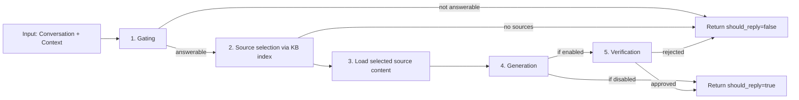

# Module Design: AI Response

## Purpose

The AI Response module is responsible for all LLM-based operations in the bot. Its primary purpose is to generate safe answers to user questions using a Knowledge Base. It also provides simple LLM call interfaces for other modules that need single-step LLM operations.

## Responsibilities

- **Answer Generation**: Orchestrate a multi-step workflow to decide if a question is answerable, select sources, load content, generate an answer, and verify it.
- **Simple LLM Calls**: Provide a reusable `invoke_llm` interface for single-step LLM operations.
- **Safety & Verification**: Ensure answers are grounded in provided sources and safe to post.
- **Resource Management**: Efficiently manage LLM API calls and share a single LLM client instance.

## Public Interfaces

The `AIClient` provides interfaces for both complex multi-step workflows and simple single-step LLM operations.

### 1. Project Introduction Property (`project_introduction`)

A read-only property that returns the configured `project_introduction` prompt string.

- **Output**: `str`
- **Usage**: Callers of `invoke_llm` should use this property to access the project introduction and append it to their system prompts as needed.

### 2. Generate Reply (`generate_reply`)

The main entry point for the bot's conversational capabilities.

- **Input**: `Conversation`, `RequestContext`
- **Output**: `AIResult` (contains `should_reply`, `reply_text`)
- **Implementation**: **Graph-based Orchestration** using LangGraph.

### 3. Invoke LLM (`invoke_llm`)

A generic interface for single-step LLM operations that other modules can use.

- **Input**: `system_prompt`, `user_content`, `response_model` (Pydantic model)
- **Output**: Validated Pydantic model instance
- **Behavior**:
  - Passes the system prompt directly to the LLM without modification
  - Uses `with_structured_output` for automatic JSON schema and validation
  - Uses shared `ChatCrynux` instance with configured timeouts and retries

Callers are responsible for appending `project_introduction` to their system prompts if needed. The `AIClient.project_introduction` property provides access to the configured value.

This interface enables other modules to perform LLM operations while sharing the same configuration (endpoint, model, timeouts, retries).

## Implementation Architecture

### Graph-based Orchestration (For `generate_reply`)

The complex "Generate Reply" workflow is modeled as a Directed Acyclic Graph (DAG) using `langgraph`.

#### Retrieval Strategy

The system does not use a traditional RAG pipeline where the user query is embedded and used to perform semantic search over the knowledge base.

Instead, retrieval is a two-stage, index-driven workflow:

1. The Knowledge Base provides a plain-text index where each entry contains a `source_id` and a short description of the source.
2. The LLM reads this index and selects the most relevant `source_id` values for the user question.
3. The system loads the full content for those selected sources and passes them as context to the answer-generation step.

This design makes the retrieval decision explicit and reviewable, and it avoids brittle query-to-embedding behavior for short or ambiguous questions.

Source ID rules:
- For knowledge base sources, `source_id` is namespaced as `kb:<identifier>`.
  - For file sources: `kb:<rel_path>` where `<rel_path>` is a path relative to `kb.sources_dir`.
  - For web sources: `kb:<url>` where `<url>` is the full URL.
- For team topic sources, `source_id` is namespaced as `team:<topic_filename>` (for example `team:get-test-tokens.txt`).

#### High-level Node Graph

Nodes represent distinct processing steps:

1.  **Question Gating**: Decides if the input is a question and if it is answerable.
2.  **Source Selection**: Uses the KB index to pick relevant files.
3.  **Content Loading**: Fetches full text for selected files.
4.  **Answer Generation**: Synthesizes an answer.
5.  **Answer Verification**: Optional final check for quality and safety.

#### Graph Reuse and Concurrency

The Graph structure is the high-level container for the workflow logic.

- **Write Once, Run Many**: The `StateGraph` is defined and compiled into a `CompiledStateGraph` (Runnable) **once** at application startup.
- **Thread-Safety**: The compiled graph is immutable and thread-safe. A single instance handles all concurrent requests.
- **Stateless Execution**: While the graph *manages* state during a single request, it does not persist it. Each request starts with a fresh state. Checkpointing is explicitly disabled.

#### Detailed Node Designs

##### Node 1: Question gating
- **Goal**: Decide whether the input is answerable.
- **Inputs**: Conversation history, `gating_prompt`.
- **Output**: `should_reply`.
- **Behavior**: Fast fail if the user input is chit-chat or off-topic.

##### Node 2: Source selection
- **Goal**: Select relevant file paths from the KB index.
- **Inputs**: User question, `kb_index_text`, `selection_prompt`.
- **Output**: List of `selected_source_ids`.
- **Behavior**: The LLM analyzes the index (which contains file summaries) to pick the best matches.

##### Node 3: Load selected source content
- **Goal**: Retrieve full text for the chosen IDs.
- **Inputs**: `selected_source_ids`.
- **Output**: List of `{source_id, text}`.
- **Behavior**: Calls the Knowledge Base module. If loading fails for all sources, the flow stops.

##### Node 4: Answer generation
- **Goal**: Produce a concise answer.
- **Inputs**: User question, loaded source text, `answer_prompt`.
- **Output**: `draft_answer`.
- **Constraints**: Must use only provided context. Must not hallucinate.

##### Node 5: Answer verification
- **Goal**: Final safety check.
- **Inputs**: Draft answer, source context, `verification_prompt`.
- **Output**: `verification` (boolean).
- **Behavior**: Acts as a "supervisor" to reject low-quality or unsafe answers. This step is skipped unless verification is enabled in configuration.

### Direct LLM Calls

The `invoke_llm` interface bypasses the LangGraph workflow and uses a shared `ChatCrynux` instance directly. This avoids graph state management overhead for straightforward single-step tasks.

**Shared LLM Instance**:
- A single `ChatCrynux` instance is created at `AIClient` initialization
- Configured with the same LLM settings as the graph (endpoint, model, timeouts, retries)
- Reused across all `invoke_llm` calls

**Output**:
- **JSON-only**: Callers MUST provide a Pydantic model and the LLM MUST return JSON that validates against the model.
- **Text via JSON**: For single string outputs, callers SHOULD use `LLMTextResult` with a single `text` field.

## Link Inclusion

When the selected sources include URL identifiers, the final reply text includes a short "Links" section with those URLs. This makes it easier for users to jump directly to the primary references without requiring citation formatting in the answer text.

## LLM Integration

The module uses `langchain-crynux` (`ChatCrynux`, ChatOpenAI-compatible) for all LLM interactions:

- **Graph workflow**: A `ChatCrynux` instance is created at graph build time and injected into graph nodes
- **Simple calls**: A shared `ChatCrynux` instance is created at `AIClient` initialization and reused for all direct LLM calls

## Shared Data Models

See `src/community_intern/core/models.py`. The module relies on:
- `Conversation`: Platform-agnostic chat history.
- `AIResult`: The standardized output contract.

## Configuration

The AI module is configured under the `ai` section in `config.yaml`.

### Shared Keys (Connection & Resilience)
- `llm_base_url`: Base URL for the LLM API.
- `llm_api_key`: API key for the LLM.
- `llm_model`: Model name to use.
- `vram_limit`: Minimum GPU VRAM required for the inference run in GB.
- `llm_timeout_seconds`: Timeout per individual LLM call (network timeout).
- `max_retries`: Maximum retry attempts for transient failures.

### Graph-Specific Keys (`generate_reply`)
- **Workflow Timeout**: `graph_timeout_seconds` (End-to-end timeout for the entire graph execution).
- **Project Introduction**: `project_introduction` (shared domain introduction appended to multiple prompt steps).
- **Verification Toggle**: `enable_verification` (When `true`, run the verification step after generation. When `false`, return the generated answer as final without verification. Default: `false`.)
- **Prompts**: `gating_prompt`, `selection_prompt`, `answer_prompt`, `verification_prompt`.
- **Limits**: `max_sources`, `max_answer_chars`.

## Error Handling

- **Timeouts**: Strict timeouts apply to the overall request and individual LLM calls.
- **Fail-Safe**: If any step in the graph fails (e.g., API error, validation error), the module returns `should_reply=false` rather than crashing.
- **Logging**: Detailed logs capture the decision path (gating -> selection -> generation) for debugging.

## Prompt Assembly Rules

The configuration provides task-focused prompt content only. The runtime assembles the final system prompts by appending shared and fixed requirements in code:

- For the graph workflow (`generate_reply`): `project_introduction` is appended to the system prompt for gating, source selection, answer generation, and verification.
- For simple LLM calls (`invoke_llm`): Callers are responsible for appending `project_introduction` to their prompts using `ai_client.project_introduction`.
- All LLM calls MUST use JSON-only structured outputs. Output format requirements are enforced in code and are not configurable.

## Observability

- **Logs**: Latency, decision outcomes (e.g., `should_reply`), and token usage.
- **Metrics**:
  - `ai_requests_total`: Counters for success/skip/error.
  - `ai_gate_total`: Track how often the bot decides to answer.
 - **Batch boundary debug logs**:
   - `discord.user_batch_wait`: Emitted when the adapter schedules or resets the quiet-window timer after a user message in a channel.
   - `discord.user_batch_process_start`: Emitted when the adapter starts processing a completed user message batch and is about to call `generate_reply`.
